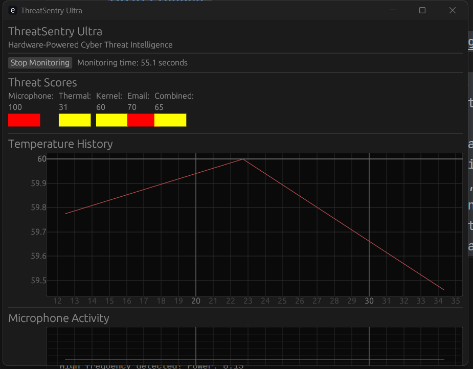

# ThreatSentry Ultra: Hardware-Powered Cyber Threat Intelligence

🌌 ThreatSentry Ultra transforms your Windows laptop into a cyber-fortress, using its microphone, thermal sensors, and email monitoring to hunt threats in real time. Detect phishing emails, ultrasonic malware beacons, crypto-miners spiking your CPU—all with zero paid APIs. Built in Rust for speed and safety, it's your personal cyber superpower, runnable on any Windows machine. Perfect for bug bounty hunters, remote workers, and techies who want to flex their security game.




## Features

🎙️ **Microphone Monitoring**: Detects high-frequency audio (e.g., ultrasonic beacons from rogue devices) that could indicate malware communication.

🌡️ **Thermal Tracking**: Flags CPU/GPU temperature spikes that might indicate crypto-miners or other resource-intensive malware.

🛠️ **Kernel Telemetry**: Monitors system processes and USB device insertions to detect suspicious activity.

📧 **Email Scanning**: Catches phishing links in emails by connecting to your IMAP server and analyzing URLs.

🔔 **Alerts**: Desktop notifications for high-risk threats with color-coded severity indicators.

📊 **Real-time Dashboard**: Interactive GUI with real-time graphs and threat visualization.

🔒 **Privacy-First**: All processing happens locally—no data leaves your laptop.

## 📸 Screenshots

|               Dashboard                |                CLI Alerts                |
| :------------------------------------: | :--------------------------------------: |
|  |  |


## 🧠 Why ThreatSentry Ultra?

Because cyber threats today are _hardware + software_ combined.
Traditional antivirus tools miss:

- Ultrasonic malware
- Local crypto miners
- Phishing at the first email hop

ThreatSentry Ultra watches _everything_ — without selling your data to the cloud.

Built for real defenders. Built for those who trust no one.

## 🛤️ Roadmap

- [x] Microphone Monitoring
- [x] Thermal Tracking
- [x] Kernel Telemetry
- [x] Email Scanning
- [x] Desktop Alerts
- [x] Real-time Dashboard
- [ ] Rogue Wi-Fi Detection (coming soon)
- [ ] USB Device Trap Monitoring (coming soon)
- [ ] Accelerometer Anti-Tamper Detection (future idea)

## Installation

### Prerequisites

- Rust and Cargo (latest stable version)
- Windows 10/11 (64-bit)
- Microphone access permissions
- Email account with IMAP access enabled

### Building from Source

1. Clone the repository:

   ```
   git clone https://github.com/RaheesAhmed/ThreatSentry.git
   cd threat-sentry
   ```

2. Build the project:

   ```
   cargo build --release
   ```

3. Run the application:
   ```
   cargo run --release -- --help
   ```

## Usage

ThreatSentry Ultra offers both a command-line interface and a graphical user interface.

### Command-Line Interface

#### Email Monitoring

```
cargo run -- email -u your_email@example.com -p your_password -l 5
```

- `-u, --username`: Your email address
- `-p, --password`: Your email password or app password
- `-l, --limit`: Number of recent emails to scan (default: 10)

#### Microphone Monitoring

```
cargo run -- mic -d 30
```

- `-d, --duration`: Duration to monitor in seconds (default: 60)

#### Thermal Monitoring

```
cargo run -- thermal -d 30
```

- `-d, --duration`: Duration to monitor in seconds (default: 60)

#### Kernel Monitoring

```
cargo run -- kernel -d 30
```

- `-d, --duration`: Duration to monitor in seconds (default: 60)

#### Full System Scan

```
cargo run -- full -u your_email@example.com -p your_password -d 60
```

- `-u, --username`: Your email address
- `-p, --password`: Your email password or app password
- `-d, --duration`: Duration to monitor in seconds (default: 60)

### Graphical User Interface

```
cargo run -- gui -u your_email@example.com -p your_password
```

- `-u, --username`: Your email address
- `-p, --password`: Your email password or app password

The GUI provides:

1. A "Start Monitoring" button to begin monitoring
2. Real-time threat scores for each monitoring system
3. Color-coded indicators for threat levels
4. Graphs showing temperature and microphone activity over time
5. A list of detected URLs with their threat scores

## How It Works

### Microphone Monitoring

ThreatSentry Ultra analyzes audio input from your microphone, focusing on high-frequency ranges (15-20kHz) that are typically used by ultrasonic beacons. These frequencies are above human hearing but can be used by malware for covert communication.

### Thermal Monitoring

The application monitors your system's temperature using CPU usage and battery information as proxies. Unusual temperature spikes or patterns can indicate malicious activities like crypto-mining or other resource-intensive malware.

### Email Monitoring

ThreatSentry Ultra connects to your email account via IMAP, scans recent emails for URLs, and analyzes them for potential phishing threats. It assigns a threat score to each URL based on various factors.

### Threat Scoring

Each monitoring system generates a threat score from 0-100:

- 0-30: Low risk (green)
- 31-70: Medium risk (yellow)
- 71-100: High risk (red)

The combined threat score is an average of all individual scores.

## Security and Privacy

- All data processing happens locally on your machine
- No data is sent to external servers
- Email credentials are only used for IMAP connection and are not stored
- The application requires microphone access permissions

## Troubleshooting

### Common Issues

1. **IMAP Connection Failures**

   - Ensure your email provider supports IMAP
   - For Gmail, enable "Less secure app access" or use an App Password
   - Check your internet connection

2. **Microphone Access**

   - Ensure your application has permission to access the microphone
   - Check if other applications are using the microphone

3. **High CPU Usage**
   - Reduce the scanning frequency or duration
   - Close other resource-intensive applications

## Contributing

Got a wild hardware idea? Open a PR or DM me on GitHub. Built by Rahees Ahmed who loves pushing limits.

1. Fork the repository
2. Create your feature branch (`git checkout -b feature/amazing-feature`)
3. Commit your changes (`git commit -m 'Add some amazing feature'`)
4. Push to the branch (`git push origin feature/amazing-feature`)
5. Open a Pull Request
